Date: 2020-10-07

Authored by: Jaffa Romain, Anees Shaikh, and Taojun Wang.

This content can also be accessed at https://thirsty-wozniak-d4cb1f.netlify.app/2020/10/01/the-rising-blue-tide.-a-statistical-analysis-of-federal-party-opinion-in-richmond-hill/?fbclid=IwAR2LqAHqmmKUpEbHnddpBU90NrxEKuKxaDjW_aja9OllOO-Z9WVToWLyTFw (on the webpage, an animation is available that isn't available on the pdf format)
```{r setup, include=FALSE}
knitr::opts_chunk$set(collapse = TRUE)
```

```{r,echo=FALSE, message=FALSE}
#Code chunks with all our imports
library(tidyverse)
library(gganimate)
library(gifski)
library(png)
library(patchwork)
library(blogdown)
```

# Glossary of terms

To ensure clarity, we have defined the following terms:

- Red: used to refer to the Liberal party. To say that a province/riding is red, is to say that it is an electoral district that votes for the Liberal party.

- Blue: used to refer to the Conservative party. To say that a province/riding is blue, is to say that it is an electoral district that votes for the Conservative party.

- Green: used to refer to the Green party. To say that a province/riding is green, is to say that it is an electoral district that votes for the Green party.

- Orange: used to refer to the New Democratic Party(NDP). To say that a province/riding is orange, is to say that it is an electoral district that votes for the NDP.

# Non-Technical executive summary

For this month's polling update, we'd like to provide an update on the Ontario riding of Richmond Hill to the Liberal Party of Canada. Richmond Hill includes the following neighbourhoods: 

- Elgin Mills
- Bayview North
- Bayview South
- North Richvale
- Hillsview
- Bayview Hill
- South Richvale
- Langstaff
- Doncrest

Since being represented in the House of Commons, the Liberal party has dominated in federal elections, winning three consecutive elections between 2004-2008.However, recent elections have not only shown a decline in Liberal voters, but also an increase in Conservative votes. Richmond hill is now a swing riding, where one party sweeping the riding could be decisive in terms of winning the election. Swing ridings are electoral districts that elect different parties during elections. This should be an important area of focus for the Liberal party as it may decide the fate of the next election. The party benefits by receiving this poll in a few ways. Chiefly, this polling update aims to answer a few questions and provide the party with actionable data. Ultimately, there is an opportunity cost associated with every decision a political party makes. By opting for a data driven approach, the Liberal party can make a well-informed decision to invest in an area or realize that they might have to focus their efforts in ridings that may prove more fruitful.

Some of the questions include:

- How have residents voted in the past? This helps us establish whether they've voted predominantly one party, or are a swing party. The implications of this help the Liberal party plan accordingly. In the event of it being a swing riding, the party might have to concentrate it's efforts to swing the vote their way.

- What are their current attitudes towards the Liberal Party? Essentially, this question provides the party with a pulse of how the riding is currently doing. The benefit of this question will help the party divert its efforts accordingly. If the riding holds a favourable view, then the party may better spend its efforts elsewhere. 

- How do they measure on some important demographic variables? This information helps the party understand their voter base better. By gaining this understanding, the Liberals can create an effective strategy to drive up the votes here and possibly apply this strategy to other such ridings that exhibit similar responses. As well, the party stands to gain important information about what matters most to their constituents. Announcing policies about climate change might not be as effective as announcing the creation of new jobs in this riding. Without knowing this information, however, they might have an inefficient media strategy.

To sample, the riding was divided into stratums, with the stratums being the Richmond Hill neighbourhoods. A random sample of the same size was then collected from each stratum to achieve the goal of at least 3000 respondents. Participants were contacted by phone and through email in an attempt to maximize response. To protect respondent privacy, no sensitive or identifiable  information such as the name or address of the respondent was documented. 

Results from the survey indicate that the liberals may not be able to capture this riding again come next election. This begs immediate action from the party to designate an appropriate action plan. Additionally, similar such polls should be issued in other swing ridings to identify which way they lean. This month's update is both a singular data point and a trend, thus our conclusions from this must be balanced. Having subsequent such polls will help us establish whether this was just a normal spike-as a result of recent incidents, or an actual trend.


# Introduction

Richmond hill is the focus of our survey. This riding was chosen on the basis of its unstable leanings. It represents an opportunity for the Liberal party to spend time researching and creating an effective action plan.  Swing ridings are ridings that may change allegiances to parties between elections or have hotly contested votes. With its recent history and extremely close elections, Richmond hill can be categorized as swing riding. Readers may be familiar with swing states in the US; however, the voting system is quite different in Canada. Since provinces do not vote the same way states do, Canada has swing ridings. They serve a similar purpose and often become the battlegrounds of political parties. They represent a keen focus of most political parties, as elections can come down to the wire, and swing ridings often make the difference.

## Richmond Hill electory history
Richmond Hill has voted mostly Liberal since it's inception as a riding in 2004. However, the animation below showcases some key points:

1. The Liberals once had a strong hold of the riding, contesting 60% of the votes in 2004. They've been on a sharp decline since, not being able to reclaim that status ever since.

2. The Conservatives have seen a strong increase in the votes they receive. The most recent election in 2019 saw the Liberals beat out the conservatives by a slim 112 votes. The Conservatives were able to swing the riding once in 2011 but lost out again in 2015.

3. The riding is mostly contested by the Liberals and the Conservatives. NDP saw an increase in 2011 but soon returned to a previous proportion in subsequent years.

Based on survey results, Richmond Hill would not be red if an election were held today. This is precisely why the Liberal party must pay attention to this riding.


```{r, echo=FALSE, warning=FALSE, message=FALSE}

#Data in this chunk is not a simulation. We've pulled this data from Elections canada to get the official election results. We've manually created a df here and then made a little animation to showcase the movement. This is admittedly a really manual way of creating DFs. If there was a cesR package but for elections results, it would greatly speed up the process.


# If the animation doesn't work, you might have to install the png and gifski packages.


years <- c(2019,2019,2019,2019,2015,2015,2015,2015,2011,2011,2011,2011,2008,2008,2008,2008,2006,2006,2006,2006,2004,2004,2004,2004)
party <- c("Liberal", "Conservative","NDP","Green","Liberal", "Conservative","NDP","Green","Liberal", "Conservative","NDP","Green","Liberal", "Conservative","NDP","Green","Liberal", "Conservative","NDP","Green","Liberal", "Conservative","NDP","Green")
votes <- c(21804,21592,4425,1695,23032,21275,3950,856,15160,18521,7245,1612,21488,16318,4526,3388,27837,16564,5176,2379,27102,11530,4495,2144)

rhill_election_results <- data.frame(years,party,votes) %>% as_tibble()


rhill_election_results %>% 
  group_by(years) %>% 
  summarise(party = party, percentage_votes = prop.table(votes) * 100) %>% 
  ggplot((aes(x = years, y = percentage_votes, color = party))) + 
  geom_line() + 
  geom_point() + 
  scale_color_manual(values = c("blue", "green", "red", "orange")) +
  labs(title = "Figure 1: A timeline of the voting history of Richmond Hill",
       subtitle = "Notice the turning tide and extremely close gap in 2019",
       caption = "Source: Elections Canada",
       x = "Year",
       y = "Percentage of votes") + transition_reveal(years)
```

# Survey methodology

The survey: https://www.surveymonkey.com/r/D8KBRNN?fbclid=IwAR1iL8B_kYBasO4GNID5cdS44hBCHFtMgJsRToi31fUFA68Ag2d1YfnTYjQ

The target population of the survey is all the residents of Richmond hill Riding that are eligible to vote.  The frame is all the people of the riding whose email-address or phone number are available to us. The sample is all the people among the frame population who are willing to take our surveys.
To sample, we used stratified sampling, separating the riding into stratums and randomly collecting samples without replacement from each stratum. Each stratum represents a neighbourhood in the riding from the following:

- Elgin Mills
- Bayview North
- Bayview South
- North Richvale
- Hillsview
- Bayview Hill
- South Richvale
- Langstaff 
- Doncrest 

Therefore, each stratum has the same proportion in the sample as it does in the target population. Also, any resident can be selected at most once because everyone has only one vote. The theorem of SRSWOR suggests that the design-based variance of $$\bar{y}$$ is given by: $$V(\bar{y}) = (1 - (n/N)*(\sigma^2_y/n)$$. Intuitively, this means that we can expect for the variance of each sampled stratum to be very small when the sample size is large relative to the population. The theorem also tells us that the sample mean $$\bar{y}$$ is a design-unbiased estimator for the true population mean: $$E(\bar{y}) = \mu_y$$. We will use phone calls and email to reach our desired respondents, and each survey is estimated to take about 5 minutes. 

To reduce non-response, we have tried to make the survey more user-friendly, attractive (clean interface), non-intrusive (doesn't collect any personal information), and time-conscious. If the non-responses are few and are randomly spread in the target population, then they can be neglected in the analysis. Non-response in certain questions can lead to different numbers of observations in the same variable, which might make it harder to construct a model. Non-response of some people (empty questionnaires) will make our sample less reflective if they are from some specific groups, which could lead to bias towards a particular group. In this case, we need to adjust the weights in our sample to have a sample reflective of the population we wish to observe.

Finally, to protect respondent privacy, the entire survey will be anonymous and includes no information which indicates respondents’ identity. Additionally, we're greatly limiting the types of information we're collecting that could be qualified as Personally Identifiable Information (PII). Also, in terms of some relatively sensitive information such as age and household income, respondents just need to select a range instead of the exact number to further ensure confidentiality.

# Results


```{r, echo=FALSE, warning=FALSE}
#Going to hardcode a few survey parameters to cut down on repeated code

set.seed(416) #a nod to the toronto region code
survey_size <- 3000 #our chosen sample size


#Construction of our df:

#The first part of the construction includes establishing all our parameters. All the questions are broken down in the format of : 
#Question that was posed in the survey
#possible_responses <- c("a","b")
#probability_of_possible_responses <- c(.45,.55)


#Which party did you vote for in 2019

list_of_parties_2019 <- c("Liberals", "Conservatives", "Green Party", "NDP", "People's", "Rhinoceros")
prob_of_voting_2019 <- c(0.44,0.42,0.03,0.08,0.01,0.002) #These probabilities were gathered from historical voting data for this riding. Data was found on Elections Canada results.This data is referenced in the references section

#Which party did you vote for in 2015?

list_of_parties_2015 <- c("Liberals", "Conservatives", "Green Party", "NDP")
prob_of_voting_2015 <- c(0.46,0.43,0.03,0.08) #These probabilities were gathered from historical voting data for this riding. Data was found on Elections Canada results. This data is referenced in the references section


#If an election were held tomorrow, which party would you vote for?
list_of_parties_2020 <- c("Liberals", "Conservatives", "Green Party", "NDP","Other")#These probabilities were generated in a few ways. 1)Extrapolating from the above animation, the riding seems to be swinging towards the conservatives again. 2)Voting in Federal elections often mirrors provincial elections, thus further giving credence to a conservative win. 3)Similar such projections are found
prob_of_voting_2020 <- c(0.430,0.47,0.025,0.07,0.005)

#Which provincial party did you vote for in 2018?
provincial_elections <- c("Progressive Conservative", "Liberal", "New Democratic", "Green", "Libertarian")
provincial_elections_prob <- c(0.51,0.28,0.17,0.03,0.0006)#These probabilities were gathered from historical voting data for this riding. Data was found on Elections Ontario results. This data is referenced in the references section


#Q What range does your income fall under?
incomes <- c("Under $15,000", "Between $15,000 and $29,999", "Between $30,000 and $49,999", "Between $50,000 and $74,999", "Between $75,000 and $99,999", "Between $100,000 and $150,000", "Over $150,000")
incomes_probability = c(0.05, 0.1, 0.14,0.17,0.14,0.18, 0.22) #The probabilities for the income were established by using similar values that are found in the 2016 Census profile for Richmond hill


#Q: What is your age group?
age_groups <- c("18-24", "25-34", "35-44", "45-54", "55-64", "65+")
age_distribution <- c(.16,0.130,0.16,0.22,0.16,0.17)#The probabilities for the age were established by using similar values that are found in the 2016 Census profile for Richmond hill


#Q What issues are the most important to you ahead of the next federal election
important_issues <- c("Affordable housing", "Balancing the budget", "Privatization of healthcare", "Immigration", "Unemployment", "Climate change")
most_important_issues_prob = c(0.28, 0.15, 0.005,0.31,0.25,0.005)
least_important_issues_prob = c(0.005, 0.24, 0.345, 0.005, 0.005, 0.40)


#The second part of the process involves actually declaring the df, we do this by putting all our possible responses and their probabilities, and sample from them.

survey_results <- tibble(
  election_results_2019 = sample(list_of_parties_2019, survey_size, replace = TRUE, prob = prob_of_voting_2019),
  election_results_2015 = sample(list_of_parties_2015, survey_size, replace = TRUE, prob = prob_of_voting_2015),
  election_results_2020 = sample(list_of_parties_2020, survey_size, replace = TRUE, prob = prob_of_voting_2020),
  elections_results_provincial_2020 = sample(provincial_elections, survey_size, replace = TRUE, prob = provincial_elections_prob),
  age_range_responses = sample(age_groups, survey_size, replace = TRUE, prob = age_distribution),
  income_range_responses = sample(incomes, survey_size, replace = TRUE, prob = incomes_probability),
  most_important_issues = sample(important_issues, survey_size, replace = TRUE, prob = most_important_issues_prob),
  least_important_issues = sample(important_issues, survey_size, replace = TRUE, prob = least_important_issues_prob),
  current_government_score = rnorm(survey_size, mean = 5, sd = 2)
)


```


```{r,echo=FALSE}
#Q: What is your age group?

survey_results %>% 
ggplot(aes(x = age_range_responses, fill = age_range_responses)) + 
geom_bar()  +
labs(title = "Figure 2: Distribution of age in Richmond Hill",
     caption = "Source: Simulated data.",
     x = "Age group",
     y = "Number of people",
     fill = "Age group brackets",
     tag = "[2]") + theme(legend.position = "none")


```
Inferring from Figure 1, Richmond hill has a fairly uniform spread for age. It has a strong peak in 45-54 age group, signalling an aging population. A point of further study could be measuring the association between age and voting habits.

```{r,echo=FALSE}
#Q: What range does your household income fall into?


survey_results %>% 
ggplot(aes(x = income_range_responses, fill = income_range_responses)) +
geom_bar() + coord_flip() +
labs(title = "Figure 3: Income range of residents of Richmond Hill",
     caption = "Source: Simulated data.",
     x = "Income Range",
     y = "Number of people",
     fill = "Income range",
     tag = "[3]") + theme(legend.position = "none")


```
In figure 3, it is clear that Richmond hill has a high proportion of residents making more than $100,000. Such variables may influence voting habits. The average income of Richmond Hill is also higher than Toronto.

```{r,echo=FALSE}
#Simulation of Q:  Whom did you vote for in the last elections?

survey_results %>% 
ggplot(aes(x = election_results_2019, fill = election_results_2019)) + 
geom_bar() + 
scale_fill_manual(values = c("blue", "green", "red", "orange", "brown", "pink")) +
labs(title = "Figure 4: Which party did you vote for in the 2019 federal elections?",
     subtitle = "The People's party and Rhinoceros party were new additions to this election.",
     caption = "Source: Simulated data.",
     x = "Federal Party",
     y = "Number of votes",
     fill = "Party",
     tag = "[4]")


```


```{r,echo=FALSE}
#Simulation of Q:  Whom did you vote for in the 2015 elections?
survey_results %>%
ggplot(aes(x = election_results_2015, fill = election_results_2015)) + 
geom_bar() + 
scale_fill_manual(values = c("blue", "green", "red", "orange", "brown", "pink")) +
labs(title = "Figure 5: Which party did you vote for in the 2015 federal elections?",
     caption = "Source: Simulated data.",
     x = "Federal Party",
     y = "Number of votes",
     fill = "Party",
     tag = "[5]")
```
Figures 4 and 5 indicate that our sample has voted mostly red, though the conservatives are coming in at a close second.
```{r,echo=FALSE}
#Q: Whom did you vote for in the provincial elections?

survey_results %>% 
  ggplot(aes(x = elections_results_provincial_2020, fill = elections_results_provincial_2020)) + 
  geom_bar() + 
  coord_flip() +
  scale_fill_manual(values = c("green", "red", "brown", "orange", "blue")) + 
  labs(title = "Figure 6: Which party did you vote for in the 2018 Provincial 
       Elections?",
       caption = "Source: Simulated data.",
       x = "Type of spending",
       y = "Number of people",
       fill = "Provincial Party Legend",
       tag = "[6]")

```
Figure 6 showcases the crushing victory of the Progressive Conservative Party of Ontario. Federal election results may mirror that of the provincial elections. This seems to be confirmed by figure 7. 


```{r,echo=FALSE}
#Simulation of Q:  If you could vote tomorrow, which of the parties would you vote for?

survey_results %>% 
ggplot(aes(x = election_results_2020, fill = election_results_2020)) + 
geom_bar() + 
scale_fill_manual(values = c("blue", "green", "red", "orange", "brown", "pink")) +
labs(title = "Figure 7: If you could vote tomorrow, which of the parties would you vote for?",
     caption = "Source: Simulated data.",
     x = "Federal Party",
     y = "Number of votes",
     fill = "Party",
     tag = "[7]")
```
Figure 7 is not a good result for the Liberal party. It shows that most respondents would now vote Conservative. The riding may now be swinging towards the conservatives.


```{r, echo=FALSE, message=FALSE}
#Simulation of Q:  Overall, how would you rate the performance of the current federal government party(1-10)?
survey_results %>% 
  ggplot(aes(x = current_government_score)) + 
  geom_histogram() +  
  labs(title = "Figure 8: Rate the performance of the current federal government party?",
       subtitle = "The rating was on a scale of 1-10",
       caption = "Source: Simulated data.",
       x = "Rating",
       y = "Number of responses",
       tag = "[8]")
```
Figure 8 indicates a poor approval rating from the respondents. With an average score of 5, residents do not seem to be pleased with the current performance of the Justin Trudeau's Liberals.
```{r, echo=FALSE}
#Q Which of these issues would you consider to be of most importance ahead of the next election
survey_results %>% 
ggplot(aes(x = most_important_issues, fill = most_important_issues)) + 
geom_bar()  + coord_flip() + 
labs(title = "Figure 9: Most important issues",
     caption = "Source: Simulated data.",
     x = "Issue",
     y = "Number of people",
     fill = "Issue",
     tag = "[9]") + theme(legend.position = "none")

```


```{r,echo=FALSE}
#Q Which of these issues would you consider to be of least importance ahead of the next election

survey_results %>% 
ggplot(aes(x = least_important_issues, fill = least_important_issues)) + 
geom_bar()  + coord_flip() +
labs(title = "Figure 10: Least important issues",
     caption = "Source: Simulated data.",
     x = "Issue",
     y = "Number of people",
     fill = "Issue",
     tag = "[10]") + theme(legend.position = "none")


```
From figures 9 and 10, we gather that the residents of Richmond hill find some issues much more important than others. Primarily, they are concerned with unemployment, immigration, and affordable housing. They do not seem to be too concerned with issues such as Climate Change.


# Discussions

The results of the survey can be distilled into a few key points: 

- The Liberal party has had close calls in their 2 recent elections for Richmond hill. Even in 2015, when the Liberals were able to reclaim GTA from the Conservatives, the election wasn't an easy victory. An important consideration is that the current MP, Majid Jowhari, was an incumbent in the last election. If he were to retire, that may lower their popularity even more.


```{r, fig.cap="2011 riding map of the GTA. Source: CBC News",include=TRUE, echo=FALSE}
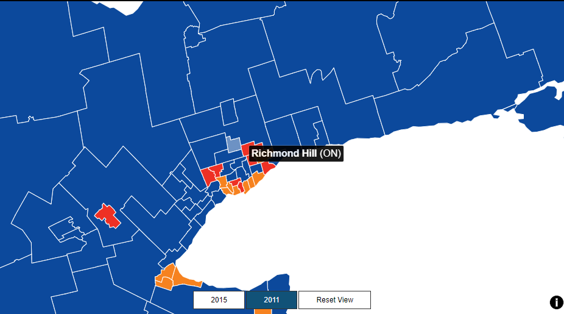
```


```{r, fig.cap="2015 riding map of the GTA. Source: CBC News",include=TRUE, echo=FALSE}
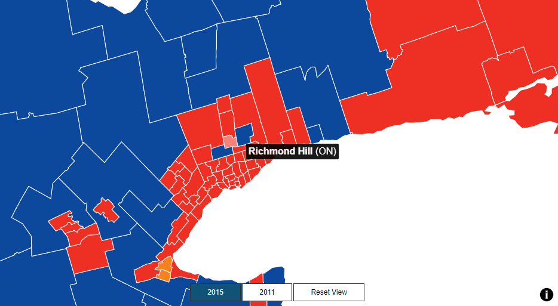
```

- In-spite of a recent win, survey results seem to indicate that a Conservative win would be most likely. It is possible that this information is a response to incidents in the past couple of months. There have been several notable happenings that may be driving this swing. For instance, the We Charity controversy and the federal government's response to the COVID-19 pandemic. By itself, this is but one of multiple data points that must be viewed in a broader context to gain something meaningful.


# Weaknesses, biases, and next steps

- We consider all the eligible voters of the riding as our target population and select samples from them. However, in the 2015 election, 38.6% of the total eligible voters did not vote. If some specific groups respond to the survey but do not vote in the end, our estimation of the election will very likely be distorted. 

- Non-response is another problem. If a considerable number of people with similar characteristics do not complete the survey (including those who finish it partially), we are unable to get information from them, which will make our model incomplete and potentially misleading. 

- It is based on a few assumptions. One of the assumptions is static performance of the party. Any number of things could happen before the next election that may eventually swing the riding back into the liberals. Another assumption is static demographics of the riding. It represents this month's polling values with a specific set of parameters- age, income, government activities. It is reasonable to expect that these things will change over time. Advanced analysis should include collating these results over a set period of time to identify some trends. 

- This sort of poll also represents an opportunity for further studies. For example, other ridings with similar demographic makeups may vote a similar way. This gives the Liberal party a much more precise view of their voters. Additionally, this poll could also be re-done with more questions. 

- Ethnic origin might be an interesting variable to survey. It provides the party with two pieces of information- change in ethnic make-ups over time, and the change in voting that it may bring along. Again, this will provide an opportunity for the party to see if such demographic shifts occur in other ridings and then utilize a specific strategy accordingly.


# References

- CBC. (2015). Federal election results 2015. Retrieved from the CBC website: https://www.cbc.ca/news2/interactives/results-2015/

- Elections Ontario. (2018). Valid Votes Cast for Each Candidate-2018 General election. Retrieved from the Elections Ontario Website: https://results.elections.on.ca/en/publications

- Elections Canada (2004). Official Voting results. Retrieved from the Elections Canada Website:
https://www.elections.ca/scripts/OVR2004/default.html

- Elections Canada (2006). Thirty-ninth General Election 2006: Official Voting Results. Retrieved from the Elections Canada Website: https://www.elections.ca/content.aspx?section=res&dir=rep/off/39gedata&document=summary&lang=e

- Elections Canada (2008). OFFICIAL VOTING RESULTS FORTIETH GENERAL ELECTION 2008. Retrieved from the Elections Canada Website: https://www.elections.ca/scripts/OVR2008/default.html

- Elections Canada (2011). OFFICIAL VOTING RESULTS FORTY-FIRST GENERAL ELECTION 2011. Retrieved from the Elections Canada Website: https://www.elections.ca/scripts/ovr2011/default.html

- Elections Canada (2015). FORTY-SECOND GENERAL ELECTION 2015 — Poll-by-poll results. Retrieved from the Elections Canada Website: https://www.elections.ca/res/rep/off/ovr2015app/41/9878e.html

- Elections Canada (2019). FORTY-THIRD GENERAL ELECTION 2019 — Poll-by-poll results. Retrieved from the Elections Canada Website:https://www.elections.ca/res/rep/off/ovr2019app/51/11129e.html

- JJ Allaire, Jeffrey Horner, Yihui Xie, Vicent Marti and Natacha Porte (2019). markdown: Render Markdown with the C Library
  'Sundown'. R package version 1.1. https://CRAN.R-project.org/package=markdown

- Jeroen Ooms (2018). gifski: Highest Quality GIF Encoder. R package version 0.8.6. https://CRAN.R-project.org/package=gifski

- R Core Team (2020). R: A language and environment for statistical computing. R, Foundation for Statistical Computing, Vienna, Austria. URL, https://www.R-project.org/.

- Simon Urbanek (2013). png: Read and write PNG images. R package version 0.1-7. https://CRAN.R-project.org/package=png

- Statistics Canada. 2017. Richmond Hill, T [Census subdivision], Ontario and Ontario [Province] (table). Census Profile. 2016 Census. Statistics Canada Catalogue no. 98-316-X2016001. Ottawa. Released November 29, 2017.
https://www12.statcan.gc.ca/census-recensement/2016/dp-pd/prof/index.cfm?Lang=E (accessed October 6, 2020)

- Thomas Lin Pedersen and David Robinson (2020). gganimate: A Grammar of Animated Graphics. R package version 1.0.6. https://CRAN.R-project.org/package=gganimate

- Thomas Lin Pedersen (2020). patchwork: The Composer of Plots. R package version 1.0.1. https://CRAN.R-project.org/package=patchwork

- Wickham et al., (2019). Welcome to the tidyverse. Journal of Open Source Software, 4(43), 1686, https://doi.org/10.21105/joss.01686

- Yihui Xie (2020). blogdown: Create Blogs and Websites with R Markdown. R package version 0.20.


# Appendix

## Code Appendices
All code can be found at this repo: https://github.com/aneesshake/political_consulting.
Specific code can be found: https://github.com/aneesshake/political_consulting/blob/main/content/post/2015-07-23-r-rmarkdown.Rmd


## Survey questions:

The survey can be accessed at: https://www.surveymonkey.com/r/D8KBRNN?fbclid=IwAR1a6S7vhUBI0shi_n9BC8Vf3gauhSp35ZAu2JGV53FFypjsfP_OzCMHwqk

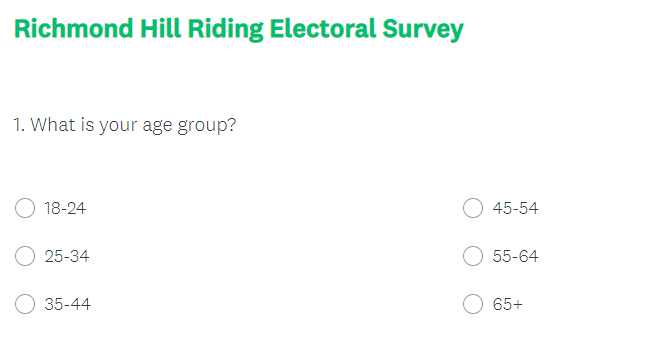
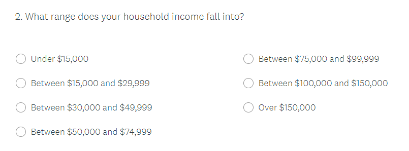
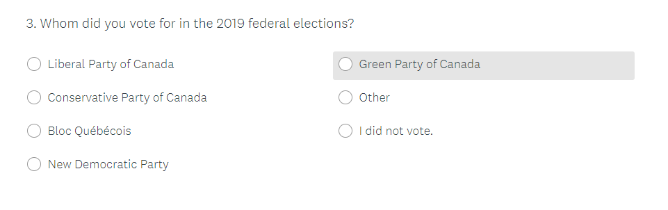


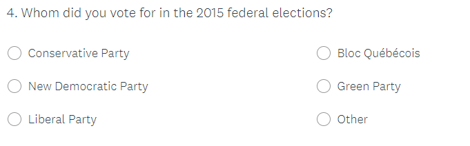
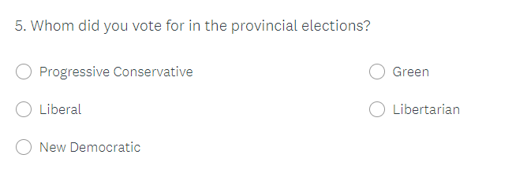
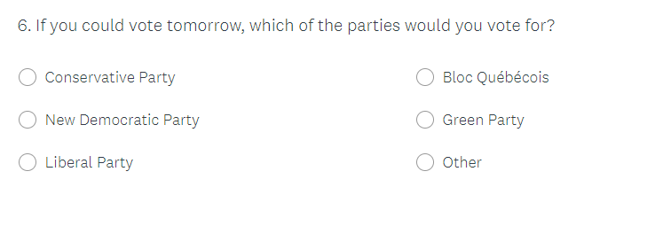
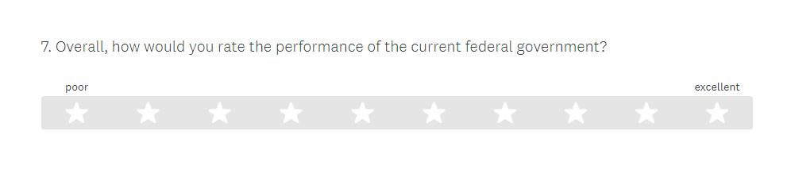
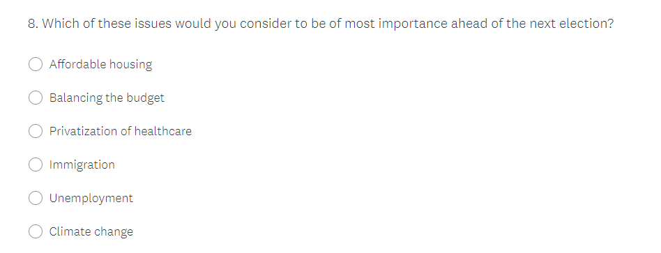
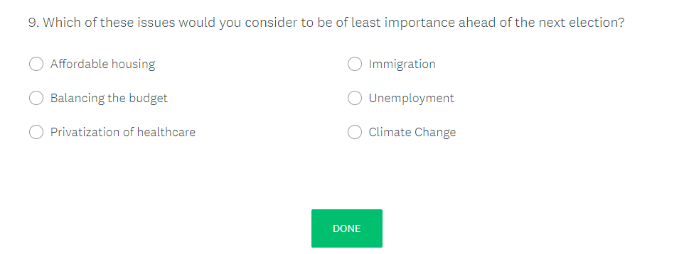


